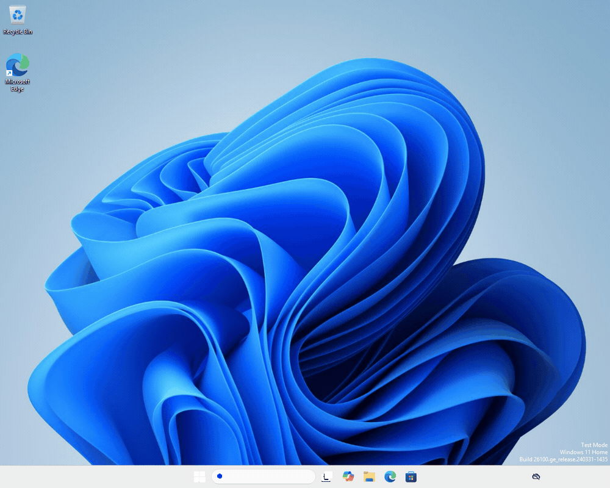

# BridgeVM

[](https://github.com/Ketchio-dev/bridgevm/actions/workflows/ci.yml)
[](https://github.com/Ketchio-dev/bridgevm/actions/workflows/security-quality.yml)
[](LICENSE)

**A Mac-native virtualization project for Apple silicon, with a custom Windows 11 Arm VMM built directly on Hypervisor.framework.**

<p align="center">
  
</p>
<p align="center">
  <em>Windows 11 Arm booting from UEFI firmware to the installed desktop on BridgeVM's own
  QEMU-free VMM — captured directly from the VM's display pipeline.</em>
</p>

BridgeVM has three deliberately separate engines: a broad QEMU compatibility
path, a lightweight Apple Virtualization.framework path, and a QEMU-free Windows
HVF engine. The Windows engine is the main engineering focus and already boots an
installed Windows 11 Arm desktop with persistent storage, display and input,
networking, audio, guest integration, TPM/Secure Boot support, snapshots, and
experimental accelerated 3D.

> [!IMPORTANT]
> BridgeVM 1.0 is a developer-oriented release. Every release-blocking criterion
> is proven by live evidence on real hardware, and the exact boundaries — what is
> proven, what is experimental, and what is out of scope — are recorded in the
> generated capability summary below rather than promised in prose.

## At a glance

| Engine | Backend | Best for | State |
| --- | --- | --- | --- |
| **Windows HVF** | Hypervisor.framework + BridgeVM device model | Windows 11 Arm on Apple silicon | Active focus; installed desktop and experimental 3D are live-proven |
| **Apple VZ** | Virtualization.framework | Lightweight Linux/macOS Arm guests | Working narrow fast path |
| **Compatibility** | QEMU + HVF/TCG | Broad guest support and emulation | Working supervised compatibility path |

### Windows HVF highlights

- QEMU-free Windows 11 Arm execution on BridgeVM's own VMM;
- persistent NVMe storage and UEFI variable state;
- SMP, PCIe, xHCI keyboard input, virtio networking, and host audio (absolute
  pointer delivery works, but click reliability is an open defect — see the
  known limitations below);
- dynamic display resizing, clipboard integration, and folder transfer through
  the guest-agent path;
- TPM 2.0, Secure Boot, measured-boot evidence, encrypted vTPM lifecycle, and
  recovery/migration tooling;
- powered-off disk + UEFI-vars snapshots with byte-exact restore checks;
- experimental guest Vulkan and D3D11-compatible rendering through the 3D
  virtio-gpu path;
- deterministic hosted CI plus separate live-gate receipts for tests that need a
  real Apple-silicon Mac and private Windows media.

The project deliberately distinguishes **code that compiles**, **deterministic
model tests**, and **behavior observed in a real guest**. Capability claims below
come from the machine-readable registry rather than being maintained by hand.

<!-- BEGIN GENERATED: capability-summary -->
**Product state: 1.0.** Runs an installed Windows 11 Arm desktop on BridgeVM's own Hypervisor.framework VMM with persistent storage, display/input, dynamic resolution, network, audio, clipboard and folder integration, TPM/Secure Boot workflows, snapshots, window Coherence verbs and experimental 3D. Every release-blocking criterion is proven by live evidence; known open defects are disclosed below.

Release-blocking criteria proven: **19 / 19**. Open: none.

Known open defects:
- **B4**: Pointer clicks are unreliable: in the latest 10-boot live batch the host delivered every click but Windows acted on only 1 of 10. Keyboard input is unaffected. Tracked as criterion B4.

- Graphics: Experimental Vulkan path and Experimental D3D11-compatible subset.
- Guest platform: QEMU virt-compatible guest contract with documented deviations.

State reviewed 2026-08-20 at commit `ab8c9788148179094a021757d308ad252cf9c478`. This block is generated from [`capabilities/windows-hvf.json`](capabilities/windows-hvf.json) by `scripts/render-capability-status.py`.
<!-- END GENERATED: capability-summary -->

For the exact thresholds and receipts, see the
[Windows capability matrix](docs/windows-arm/capability-matrix.md) and
[current status](STATUS.md).

## Quick start

For a packaged build, follow the
[macOS installation guide](docs/install.md), including the documented
Gatekeeper steps for the ad-hoc-signed distribution.

### Requirements

For development from source:

- Apple-silicon Mac running macOS 14 or newer;
- Xcode / Swift 5.9 or newer;
- Rust 1.85 or newer;
- QEMU only if you want to use the Compatibility Engine;
- the host dependencies checked by the packaging/graphics scripts when building
  a self-contained Windows HVF bundle.

### Build the workspace

```sh
cargo build --workspace
cargo test --workspace
cargo run -p bridgevm-cli -- doctor
```

Build the Swift targets:

```sh
swift build --package-path apps/macos
swift test --package-path apps/macos
```

### Build the Mac app

For a local ad-hoc-signed development app:

```sh
packaging/macos/build-debug-app-bundle.sh
open target/macos/BridgeVMApp.app
```

For a redistributable **ad-hoc-signed DMG** without Developer ID or
notarization:

```sh
./packaging/macos/build-preview-dmg.sh
```

The DMG builder produces:

```text
target/preview/BridgeVM.app
target/preview/BridgeVM.dmg
target/preview/BridgeVM.dmg.sha256
```

The artifact is built in release configuration, ad-hoc signed, and
includes the Apache-2.0 project license, third-party notices, Rust dependency
license inventory, the nested Windows HVF app notices, and a SHA-256 checksum for
the DMG. It does **not** require a paid Apple Developer account, Developer ID
certificate, or notarization.

The older `build-debug-app-bundle.sh` and `build-debug-dmg.sh` paths remain useful
for local developer diagnostics; use `build-preview-dmg.sh` for an artifact you
intend to hand to another technical tester.

If a downloaded build is blocked by macOS, use the supported
**System Settings → Privacy & Security → Open Anyway** flow. Advanced users who
understand the trust implications can also remove the quarantine attribute from
a build they obtained from a source they trust:

```sh
xattr -dr com.apple.quarantine /Applications/BridgeVM.app
```

Removing quarantine bypasses a macOS safety check; it does not authenticate the
build. Compare the downloaded DMG against the published `.sha256` before doing
this.

## Licensing

BridgeVM's own code is Apache-2.0; see [`LICENSE`](LICENSE). Third-party
components, what is deliberately not shipped, and the checks that keep those
statements true are in [`THIRD-PARTY-NOTICES.md`](THIRD-PARTY-NOTICES.md) and
[`docs/licensing-and-attribution.md`](docs/licensing-and-attribution.md).

## Windows media and drivers

BridgeVM does **not** redistribute Windows. Bring your own Windows 11 Arm media
and use it under the terms of your Microsoft license.

The Windows HVF installer path can inject the guest-side drivers needed by the
VM. Development graphics packages may require Windows test-signing mode; do not
assume every experimental driver package is production-signed. The current
first-boot flow can stage the package, enable test-signing, trust the package
certificate, clean superseded DriverStore generations, bind the driver, reboot,
and verify the resulting device/package identity.

Windows may refuse the test-signing BCD change when Secure Boot policy blocks it.
BridgeVM treats that as an explicit preview-driver setup failure rather than
silently weakening the guest's security state. The exact driver lifecycle is in
[`scripts/win-assets/DRIVERS-README.md`](scripts/win-assets/DRIVERS-README.md).

A test-signing requirement is a property of the guest driver, not of the Windows
ISO. Supplying your own ISO avoids redistributing Windows itself, but Windows
still decides whether a kernel-mode driver is trusted.

## Architecture

```text
                         BridgeVM for macOS
                                |
          +---------------------+---------------------+
          |                     |                     |
          v                     v                     v
  Compatibility Engine    Apple VZ Engine       Windows HVF Engine
       QEMU + HVF          Virtualization.framework  Hypervisor.framework
          |                     |                     |
   broad compatibility      Linux/macOS Arm      BridgeVM VMM + devices
                                                     |
                          +--------------------------+-------------------+
                          |       |       |       |       |      |       |
                         NVMe   xHCI   virtio   audio   agent   TPM   virtio-gpu
                                       net                    / SB     + 3D
```

The Windows engine owns its device model and runtime lifecycle. Third-party
components used for firmware, rendering, TPM support, or guest drivers retain
their own licenses and are tracked separately; see
[`THIRD-PARTY-NOTICES.md`](THIRD-PARTY-NOTICES.md).

## What is proven today

BridgeVM's release-blocking Windows HVF capability criteria are currently marked
proven in the registry. Examples of the evidence behind that classification
include:

- fresh Windows first-boot reliability meeting the configured cold-boot gate;
- repeated process-recreate reset cycles with fresh helper generations;
- a real Vulkan workload and a real D3D11 workload meeting the configured frame
  rate gate;
- keyboard, non-ASCII text, clipboard, folder sharing, audio, and dynamic resize
  receipts;
- in-app Windows installation through a 3D desktop;
- standalone packaged-app boot with the source checkout unavailable;
- TPM/PPI, Secure Boot, measured boot, recovery, migration, and snapshot
  lifecycle receipts;
- a final no-regression gate covering Rust, Swift, documentation, structural
  budgets, and hosted CI.

Those statements are intentionally narrower than "all Windows apps work" or
"production-ready." Dated receipts show what was measured on a specific build;
they are not universal compatibility promises. The generated snapshot above was
sealed on the commit it names; a later head still needs its own final
no-regression run before being treated as an equally sealed build.

## Known limitations in 1.0

The remaining work is mostly **distribution breadth, compatibility, and product
polish**, rather than proving that the core Windows VMM can reach a desktop:

- broader GPU and application compatibility beyond the current Vulkan/D3D11
  evidence set;
- clean-machine testing across more Apple-silicon generations and macOS versions;
- a simpler public install/update story;
- production driver-signing strategy for users who should not have to enable
  Windows test mode;
- optional Developer ID/notarized distribution for users who should not have to
  override Gatekeeper;
- continued hardening of recovery, migration, diagnostics, and failure UX;
- broader compatibility guarantees beyond the measured evidence set.

There are two known defects in 1.0, both disclosed in the generated capability
summary above and tracked as open criteria:

- **Pointer clicks are unreliable** (criterion B4). In the latest ten-boot live
  batch the host delivered every click but Windows acted on only one
  ([`docs/windows-arm/evidence/b4-pointer-batch-20260817.md`](docs/windows-arm/evidence/b4-pointer-batch-20260817.md)).
  Keyboard input is unaffected. The criterion stays open until a 20/20
  reliability gate passes.
- **Accelerated-path glyph rendering.** Body text renders correctly at the
  native guest resolution, but window titles, tab labels and menu bars can
  render as blank. It is investigated in
  [`docs/windows-arm/evidence/windows-glyph-text-integer-attributes-20260814.md`](docs/windows-arm/evidence/windows-glyph-text-integer-attributes-20260814.md),
  which records the live measurements, the fix that shipped for body text, and
  the correction directions that were tried and rejected.

Durable running-state suspend is intentionally outside the current v1 scope; the
powered-off snapshot path is the supported persistence boundary for now.

## Repository map

```text
apps/macos/                  SwiftUI app, Windows HVF Lab, signed runners
crates/bridgevm-hvf/         custom Hypervisor.framework VMM and devices
crates/bridgevm-hvf-runtime/ typed Windows HVF runtime lifecycle
crates/bridgevm-{cli,core}/  CLI and shared product model
crates/bridgevm-qemu/        Compatibility Engine planning
crates/bridgevm-apple-vz/    Apple VZ planning and launch support
runners/                     process boundaries for VM engines
packaging/macos/             app/DMG packaging and release verification
scripts/                     build, packaging, guest, and live-gate tooling
tests/integration/           deterministic integration and product gates
docs/                        current guides, decisions, and dated evidence
```

## Verification

Run the project-level deterministic check before treating a change as complete:

```sh
scripts/check-project.sh
```

Useful individual gates include:

```sh
cargo fmt --all --check
cargo clippy --workspace --all-targets --locked -- -D warnings
cargo test --workspace --locked
cargo +1.85.0 check --workspace --locked
scripts/check-refactor-budgets.sh
bash scripts/check-documentation-system.sh
```

Graphics-native checks have additional host dependencies and are intentionally
separate from real guest evidence. Hosted CI cannot prove nested virtualization,
a Windows boot, or a rendered guest frame; those claims require the project's
live-gate process on trusted Apple-silicon hardware.

## Documentation

Start with:

- [Current status](STATUS.md)
- [Documentation index](docs/README.md)
- [Windows 11 Arm guide](docs/windows-arm/README.md)
- [Capability matrix](docs/windows-arm/capability-matrix.md)
- [Security model](docs/security/model.md)
- [Contributing](docs/contributing/README.md)

Historical evidence is kept because a failed experiment or an old measurement
must not silently turn into a success claim. Historical notes are not the source
of truth for current product behavior.

## Contributing

BridgeVM favors small changes with explicit evidence. In particular:

- do not weaken a threshold to make a gate pass;
- do not treat deterministic tests as proof of live guest behavior;
- keep canonical guest images and private Windows media out of git and CI;
- keep security-relevant paths fail-closed;
- preserve the structural-debt ratchet rather than raising limits to land code.

See [`AGENTS.md`](AGENTS.md) and the
[contributing guide](docs/contributing/README.md) before making larger changes.

## License

BridgeVM source code is licensed under the [Apache License 2.0](LICENSE).
Third-party components keep their respective licenses; redistribution notes and
verification rules are documented in
[`THIRD-PARTY-NOTICES.md`](THIRD-PARTY-NOTICES.md).

Copyright © 2026 Ketchio-dev.
