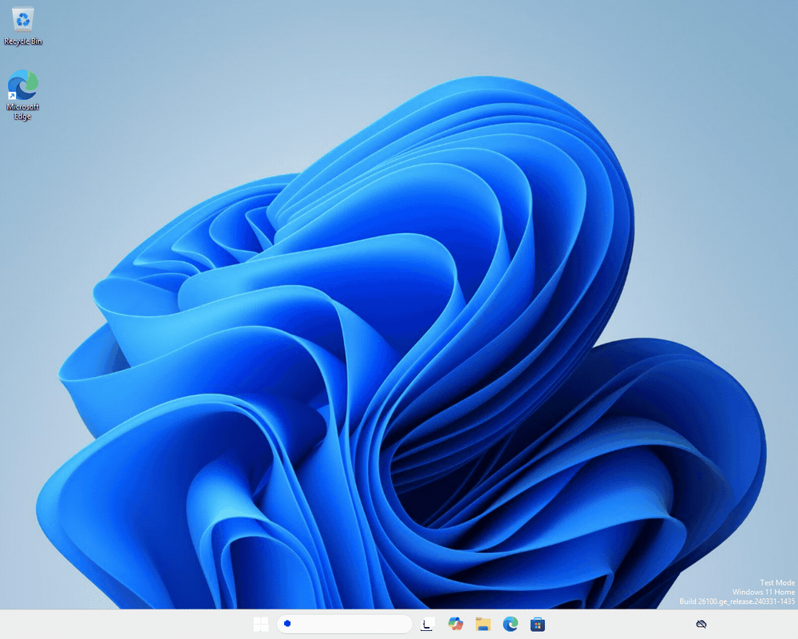

# BridgeVM

[](https://github.com/Ketchio-dev/bridgevm/actions/workflows/ci.yml)
[](https://github.com/Ketchio-dev/bridgevm/actions/workflows/security-quality.yml)
[](LICENSE)

**Run Windows 11 Arm on Apple silicon with a Mac-native, QEMU-free
Hypervisor.framework VMM.**

<p align="center">
  
</p>

BridgeVM develops its own Windows 11 Arm VMM on Apple's Hypervisor.framework.
The main engineering focus is CPU execution, interrupts and timers, device I/O,
and VM lifecycle reliability. Apple VZ and QEMU compatibility backends remain
separate engine paths.

**[Build and try the current source](docs/install.md#build-the-current-source)** ·
**[Current status](STATUS.md)** · **[Contribute](CONTRIBUTING.md)** ·
**[Documentation](docs/README.md)**

## Engineering Preview

Product wording and known defects come from the capability registry. Its dated
snapshot describes retained evidence, not a guarantee for every later commit:

<!-- BEGIN GENERATED: capability-summary -->
**Product state: Engineering Preview.** Runs an installed Windows 11 Arm desktop on BridgeVM's own Hypervisor.framework VMM with persistent storage, display/input, dynamic resolution, network, audio, clipboard and folder integration, TPM/Secure Boot workflows, snapshots and window Coherence verbs. 3D acceleration is excluded from General Preview and v1; release-blocking evidence remains open and known defects are disclosed below.

Release-blocking criteria proven: **14 / 17**. Open: A9, A11, A19.

Known open defects:
- **A9**: No retained clean-machine product-flow receipt yet proves either ISO installation or installed-disk import through the app. Both supported flows remain 3D-off. In the 3D-off configuration the app's live display window was choppy in recent hardware runs, and guest audio stuttered audibly. In r52 the display export held its 33 ms cadence, but the app window's smoothness was not measured, and audio underran in up to 3% of callbacks; with a 40 ms start reserve, a single r54 run showed 2 gaps in 1,733 callbacks, and no listening check has confirmed the stutter is gone.
- **A19**: Legacy managed storage relocated before identity migration is refused. Full interrupted-operation coverage is unproven. The ten-lane product lifecycle campaign passed 10/10 once, at 949f4c26, which the operator accepted before a release head was designated. Physical power loss during a snapshot operation is outside this criterion and is not tested.
- **B6**: Window title, tab and menu glyphs can be blank on the experimental Windows graphics path; body text alone does not prove glyph correctness.

- Graphics future path: Vulkan is a Graphics Lab future path, excluded from General Preview and v1; D3D11 compatibility is a Graphics Lab future path, excluded from General Preview and v1.
- Guest platform: QEMU virt-compatible guest contract with documented deviations.

State reviewed 2026-10-07 at commit `9e8dcf86c8045dcf6ae27919fe0191025c9d6403`. This block is generated from [`capabilities/windows-hvf.json`](capabilities/windows-hvf.json) by `scripts/render-capability-status.py`.
<!-- END GENERATED: capability-summary -->

The [capability matrix](docs/windows-arm/capability-matrix.md) contains the fixed
thresholds and exact receipts. Test results and live guest evidence are tracked
separately; a documentation update does not renew either.

## Try BridgeVM

There is currently no safe downloadable General Preview. The published
`v1.0.0` predates the fail-closed driver policy, so `install.sh` intentionally
refuses it. Use the [source-build guide](docs/install.md#build-the-current-source)
and [development setup](CONTRIBUTING.md#set-up-a-development-checkout).

Requirements: Apple silicon, macOS 14+, Xcode/Swift 5.9+, and Rust 1.85+.
Host coverage is limited; see [known limitations](STATUS.md#known-limitations).

Bring your own licensed Windows 11 Arm ISO and a signed ARM64
storage/serial/network driver payload with an external SHA-256 manifest. An ISO
alone is insufficient. The [installation guide](docs/install.md) explains the
payload contract, bundle dependencies, and local ad-hoc-signed build. The
General Preview contains no Windows test driver, does not enable TESTSIGNING,
and keeps 3D acceleration outside the release scope.

The Mac app is not Developer ID signed or Apple-notarized. Downloaded builds
require the documented trust step. Running-state suspend is outside v1;
see the [powered-off snapshot scope](docs/windows-arm/snapshot-scope-v1.md).

## Develop the VMM

Start with [CONTRIBUTING.md](CONTRIBUTING.md) for toolchains and focused checks,
[AGENTS.md](AGENTS.md) for evidence and safety rules, and the
[machine contract](docs/machine-contract/qemu-virt.md) for guest-visible behavior.

| Area | Source |
| --- | --- |
| Own Hypervisor.framework VMM and devices | [`crates/bridgevm-hvf/`](crates/bridgevm-hvf/) |
| Windows HVF runtime lifecycle | [`crates/bridgevm-hvf-runtime/`](crates/bridgevm-hvf-runtime/), [`runners/`](runners/) |
| Mac app and helper boundaries | [`apps/macos/`](apps/macos/) |
| App packaging and release verification | [`packaging/macos/`](packaging/macos/) |
| Deterministic checks and sealed live gates | [`scripts/`](scripts/), [`tests/integration/`](tests/integration/) |

For quick deterministic feedback, run `scripts/check-project.sh --fast`.
Run the complete gate before treating a repository change as done:

```sh
scripts/check-project.sh
```

Deterministic checks run on GitHub-hosted CI. Real Windows boots,
Hypervisor.framework behavior and clean-machine product journeys require the
corresponding sealed [physical-Mac live gate](docs/testing/apple-silicon-live-gates.md).

## Engine boundaries

| Engine | Backend | Focus |
| --- | --- | --- |
| **Windows HVF** | Hypervisor.framework + BridgeVM device model | Main Windows 11 Arm engineering path |
| **Apple VZ** | Virtualization.framework | Narrow Linux/macOS Arm path |
| **Compatibility** | QEMU + HVF/TCG | Compatibility and architecture emulation |

The Windows guest platform is a QEMU `virt`-compatible contract with
[documented deviations](docs/machine-contract/qemu-virt-deviations.json).
QEMU also provides `qemu-img` for offline image conversion and qcow2 disk
operations. Raw-only Windows HVF import does not need that helper.

Graphics Lab is a separate future research path, excluded from General Preview
and v1. Its retained campaigns include
[known glyph defects](docs/windows-arm/evidence/windows-glyph-text-integer-attributes-20260814.md).
Read the [distribution channel contract](docs/distribution-channels.md) before
using its test-signed packages on disposable guests.

## More information

- [Documentation index](docs/README.md) — current guides, plans, and dated history.
- [Current status](STATUS.md) — priorities, open criteria, and evidence limits.
- [Security model](docs/security/model.md) and [private vulnerability reporting](SECURITY.md).
- [Good first issues](https://github.com/Ketchio-dev/bridgevm/labels/good%20first%20issue)
  and [contribution guide](CONTRIBUTING.md).

## License

BridgeVM is licensed under [Apache-2.0](LICENSE). Third-party components retain
their own licenses; see [THIRD-PARTY-NOTICES.md](THIRD-PARTY-NOTICES.md) and the
[licensing guide](docs/licensing-and-attribution.md).

Copyright © 2026 Ketchio-dev.
